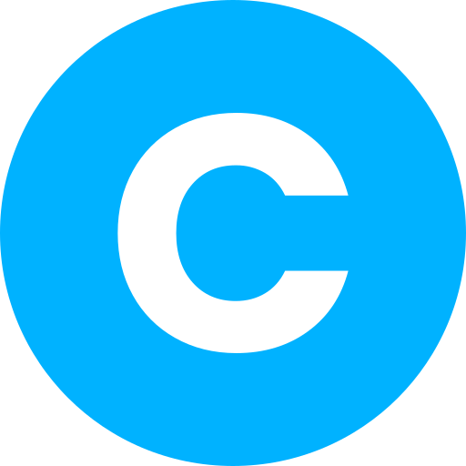
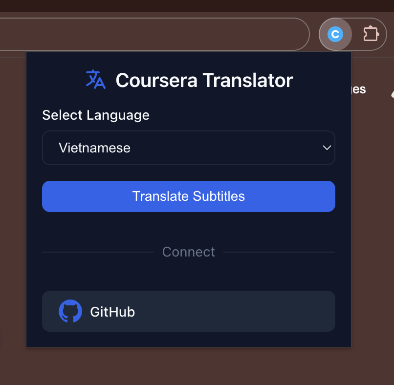
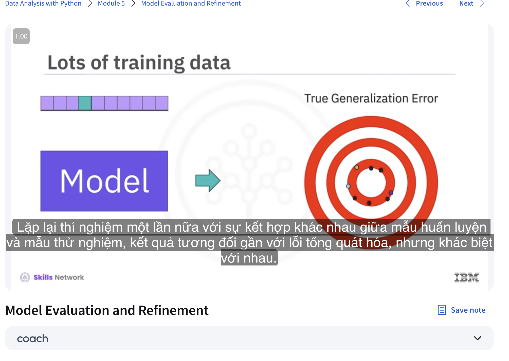

# Coursera & Deeplearning.ai Subtitle Translator

<div align="center">
  
</div>

Đây là một tiện ích mở rộng Chrome giúp dịch phụ đề tiếng Anh trong các khóa học trên Coursera và Deeplearning.ai sang tiếng Việt. Sử dụng Google Translate API để cung cấp bản dịch chất lượng và trải nghiệm học tập tốt hơn.

## ✨ Tính năng

- 🌐 Hỗ trợ dịch sang tiếng Việt
- 🎯 Hỗ trợ hai nền tảng học trực tuyến:
  - Coursera.org
  - Deeplearning.ai
- ⚡ Dịch phụ đề theo thời gian thực
- 🔄 Tự động phát hiện và xử lý phụ đề
- 💾 Cache bản dịch để tăng tốc độ hiển thị
- 🎨 Giao diện người dùng thân thiện:
  - Icon dịch tích hợp trong player video
  - Dễ dàng bật/tắt chức năng dịch
  - Hiển thị phụ đề mượt mà

## 🚀 Cài đặt

1. Tải xuống source code:
   ```bash
   git clone https://github.com/bombap/coursera-translator.git
   ```

2. Mở Chrome Extensions:
   - Truy cập `chrome://extensions/`
   - Bật "Developer mode" ở góc phải trên

3. Cài đặt Extension:
   - Click "Load unpacked"
   - Chọn thư mục chứa source code đã tải

## 📖 Hướng dẫn sử dụng

1. Mở video bài giảng trên Coursera hoặc Deeplearning.ai
2. Tìm icon 🌐 ở góc phải trên của video player
3. Click vào icon để bật/tắt chức năng dịch
4. Phụ đề sẽ được dịch tự động sang tiếng Việt

## 🛠️ Công nghệ sử dụng

- Chrome Extension Manifest V3
- HTML/CSS
- JavaScript
- Google Translate API

## 📸 Ảnh minh họa

### Giao diện Extension trên Coursera


### Giao diện Extension trên Deeplearning.ai


## 🤝 Đóng góp

Mọi đóng góp đều được chào đón! Hãy thoải mái:
- 🐛 Báo cáo lỗi
- 💡 Đề xuất tính năng mới
- 🔧 Tạo Pull Request

## 📝 Giấy phép

Dự án này được phân phối dưới giấy phép MIT. Xem `LICENSE` để biết thêm thông tin.

## 💖 Ủng hộ dự án

Nếu bạn thấy dự án hữu ích, hãy:
- ⭐ Star dự án trên GitHub
- 📢 Chia sẻ với bạn bè đang học trên Coursera hoặc Deeplearning.ai
